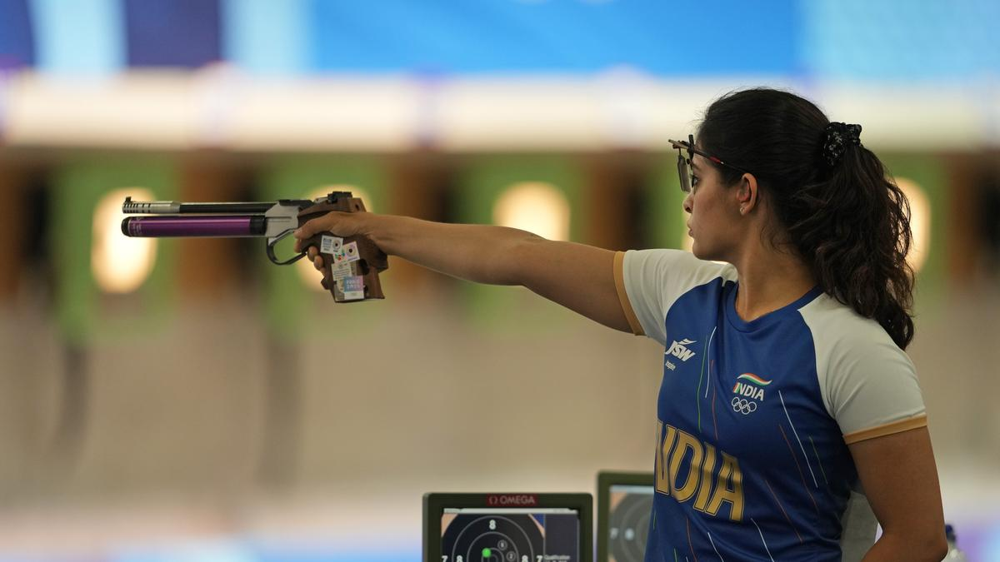

```{r setup, include=FALSE}
knitr::opts_chunk$set(echo = TRUE)
library(dplyr)
library(knitr)
library(ggplot2)
```


# **Présentation du sport** 

Le **"shooting air pistol - 10 meters"** signifie en français **"le tir au pistolet à air comprimé - 10 mètres"**. C'est une discipline sportive dans laquelle les compétiteurs utilisent des pistolets pour viser des cibles à des distances prédéfinies. Il s'agit d'un sport de précision, qui exige concentration, stabilité et contrôle. 


Le tir, en général, a une longue histoire, notamment liée à l'utilisation des armes à feu pour la chasse et la guerre. L'usage des armes à feu pour le tir sportif est né avec l'invention des premières armes à poudre noire au XIX° siècle. Les premières compétitions formelles de tir ont vu le jour en Europe au XIX° siècle, en particulier dans les pays comme l'Allemagne et la France. 

Ce sport a évolué au fil du temps, notamment avec le développement des pistolets modernes à air comprimé et à feu. C'est l'une des disciplines du tir sportif, qui comprend également le tir à la carabine et au fusil.  

Le tir au pistolet a fait ses débuts aux premiers Jeux Olympiques modernes en 1896 à Athènes. 

Ce document porte sur l'analyse du tir au pistolet à air comprimé de 10 mètres de *1992 à 2024.* 

Nous utiliserons pour cela une base de données libre d'accès et accessible [ici](https://www.kaggle.com/datasets/heesoo37/120-years-of-olympic-history-athletes-and-results). Les données des Jeux Olympics de 2022 et 2024 se trouvent sur le site officiel [ici](https://olympics.com/en/paris-2024/schedule/shooting/10m-air-pistol-men?day=undefined). 


Dans ce travail, nous allons analyser à partir des données disponibles : 

* Les caractéristiques physiques des athlètes. 
  + Âge
  + Taille
  + Poids 
  + IMC 
* Les palmarès 
  + Nombre de médailles par pays 
  + Nombre de médailles par sexe 


# I- Caractéristiques physiques des vainqueurs


Manu BHAKER est indienne. Elle a obtenu la médaille de Bronze aux Jeux Olympiques de Paris 2024. C'est la première fois qu'une personne originaire de l'Inde qui remporte cette médaille. 


{width=300}


Tout d'abord, nous allons importer notre base de données qui va nous permettre de réaliser notre analyse. 

```{r}
# Importation des données

don <- read.table(file = "data/mydon_1992_2024.csv",
                  header = TRUE,
                  sep = ";")

```


```{r}
head(don,3)
```

## Hommes 

On va calculé les moyennes et les médianes d'âge, de poids et de taille des médaillés pour cette discipline.

On obtient les résultats suivants : 

```{r}

don_h <-don[don$sex=="Homme",]

# Calculer la moyenne et la médiane en ignorant les NA

moyennestotalesh <- don_h %>% summarize(
    'Âge moyen' = mean(age, na.rm = TRUE),
    'Poids moyen' = mean(poids, na.rm = TRUE),
    'Taille moyenne' = mean(taille, na.rm = TRUE),
    'Âge médian' = median(age, na.rm = TRUE),
    'Poids médian' = median(poids, na.rm = TRUE),
    'Taille médian' = median(taille, na.rm = TRUE)
)

# Afficher le résultat
kable(moyennestotalesh, caption = "Caractéristiques moyenne des hommes sur l'ensemble de la période")

```

On va observer plus en détail la répartition au travers des histogrammes pour chacune de ces caractéristiques. 

```{r}
# Puisqu'on a 3 histogrammes on met 33% de out.width pour pouvoir les aligner correctement.

# Histogramme de l'Âge des hommes
hist(don_h$age, breaks=5, probability=FALSE, col="yellow", main = "Âge des médaillés",
        xlab = "Âge", ylab ="Fréquence par tranche")
#lines(density(don_h$age,bw=0.3),col="orange",lwd=2) si probability=TRUE pour voir la densité

# Histogramme du poids des hommes
hist(don_h$poids, breaks=5, probability=FALSE, col="lightblue", main = "Poids des médaillés",
        xlab = "Poids (kg)", ylab ="Fréquence par tranche")

# Histogramme de la taille des hommes
hist(don_h$taille, breaks=5, probability=FALSE, col="red", main = "Taille des médaillés",
        xlab = "Taille (cm)", ylab ="Fréquence par tranche")

```

# Femmes 

On va calculer les moyennes et les médianes d'âge, de poids et de taille des médaillés pour cette discipline. 
On trouve les résultats suivants : 


```{r}

don_f<-don[don$sex=="Femme",]

# Calculer la moyenne totale de l'âge, du poids et de la taille
moyennestotalesf <- don_f %>%
  summarize('Âge moyen' = mean(age, na.rm = TRUE),
    'Poids moyen' = mean(poids, na.rm = TRUE),
    'Taille moyenne' = mean(taille, na.rm = TRUE),
    'Âge médian' = median(age, na.rm = TRUE),
    'Poids médian' = median(poids, na.rm = TRUE),
    'Taille médian' = median(taille, na.rm = TRUE)
)
  

# On affiche le résultat
kable(moyennestotalesf, caption = "Caractéristiques moyenne des femmes sur l'ensemble de la période")
```

Ces résultats montrent des différences significatives entre les deux groupes en termes d'âge, de poids et de taille. 

```{r}
# Histogramme de l'Âge des femmes
hist(don_f$age, breaks=5, probability=TRUE, col="yellow", main = "Âge des médaillées",
        xlab = "Âge", ylab ="Fréquence par tranche")
#lines(density(don_f$age,bw=0.3),col="orange",lwd=2) si probability=TRUE pour voir la densité

# Histogramme du poids des femmes
hist(don_f$poids, breaks=5, probability=FALSE, col="lightblue", main = "Poids des médaillées",
        xlab = "Poids (kg)", ylab ="Fréquence par tranche")

# Histogramme de la taille des femmes
hist(don_f$taille, breaks=5, probability=FALSE, col="red", main = "Taille des médaillées",
        xlab = "Taille (cm)", ylab ="Fréquence par tranche")
```

Les femmes sont globalement plus jeune, avec un âge moyen de 27,19 ans, contre 32,26 ans pour les hommes. 
La médiane est cohérente avec les moyennes : 50 % des femmes ont 26 ans ou moins, tandis que la moitié des hommes ont 32 ans ou moins. Cela suggère que les femmes sont globalement plus jeune.

Le poids moyen des femmes est de 62,69 kg, significativement inférieur à celui des hommes (80,2 kg). La médiane des poids est proche des moyennes des deux sexes, indiquant une distribution relativement symétrique des poids.

Les femmes sont plus petites, avec une taille moyenne de 165,23 cm, contre 176,08 cm pour les hommes. Cela peut indiquer des différences de constitution physique ou des caractéristiques biologiques.
La médiane des tailles est également inférieure pour les femmes (163 cm contre 175 cm pour les hommes), renforçant cette observation.

# Nationalité des vainqueurs 

## Résultats globaux 

On va tout d’abord regarder les résultats par nation dans cette discipline dans sa globalité. On observe tout d’abord qu’il y 22 pays différents ayant obtenus une ou plusieurs médailles sur la période. 

On observe que la Chine a obtenu le plus de médailles dans cette discipline. La Russie obtient la deuxième place. 

```{r}
# Compte le nombre de médailles remportées par pays et montre quels sont les médailles en question
nb_med = count(don, pays, titre)

ggplot(nb_med, aes(fill = titre, y = n, x = pays)) + 
  scale_fill_manual(values = c("gold", "grey", "orange")) +
  geom_bar(position = position_stack(reverse = TRUE), stat = "identity") +
  labs(x = "Pays", y = "Nombre", fill = "Titre") +
  theme(
    axis.text.x = element_text(angle = 45, hjust = 1)  # Rotation des étiquettes à 45 degrés pour éviter le chevauchement
  )
```

D'autres pays, comme l'Italie (ITA), montrent également une bonne performance, mais nettement inférieure à celle de la Chine (CHN).


## Résultats par sexe 

```{r}
nb_med_h = count(don_h, pays, titre)
#On définie la variable nb_med_h qui compte le nombre de titres différents obtenus par chaques pays

ggplot(nb_med_h, aes(fill=titre, y=pays, x=n)) + 
  geom_bar(position = position_stack(reverse = TRUE), stat="identity") +
  scale_fill_manual(values=c("gold", "grey", "orange")) +
  labs(x = "Nombre de médailles", y = "Pays", fill = "Type de médaille", title = "Nombre de médailles masculine par pays et par type") +
  theme_minimal() +
  theme(axis.text.x = element_text(angle = 45, hjust = 1))
# Pour avoir les médailles correctement ordonnées dans le graphique on utilise dans geom_bar "position = position_stack(reverse = TRUE)"

nb_med_f = count(don_f, pays, titre)
#On définie la variable nb_med_f qui compte le nombre de titres différents obtenus par chaques pays


ggplot(nb_med_f, aes(fill=titre, y=pays, x=n)) + 
  geom_bar(position = position_stack(reverse = TRUE), stat="identity") +
  scale_fill_manual(values=c("gold", "grey", "orange")) +
  labs(x = "Nombre de médailles", y = "Pays", fill = "Type de médaille", title = "Nombre de médailles féminine par pays et par type") +
  theme_minimal() +
  theme(axis.text.x = element_text(angle = 45, hjust = 1))
```

Les deux graphiques montrent l'importance de la Chine dans les performances olympiques, ainsi que des disparités significatives entre les genres et les pays. Les données reflètent également une répartition variée des types de médailles, selon le genre et le pays. Les pays présents dans les deux graphiques ne sont pas toujours les mêmes, ce qui montre des différences dans les performances masculines et féminines. Les hommes semblent remporter davantage de médailles d'or, tandis que les femmes montrent une répartition plus variée. 


# Conclusion 

Pour conclure, les résultats montrent des différences significatives entre les sexes et entre les nations. Les femmes, plus jeunes et plus légères, affichent des performances diversifiées, tandis que les hommes remportent davantage de médailles d'or. La Chine domine largement cette discipline, suivie par la Russie et l'Italie, avec des disparités marquées selon le genre et le type de médaille.

# Annexe

## Données sur les hommes 

```{r}
kable(don_h, caption = "Annexe 1 : Champions olympiques de cyclisme sur route individuel 1992-2024")
```


## Données sur les femmes 


```{r}
kable(don_f, caption = "Annexe 2 : Championnes olympiques de cyclisme sur route individuel 1992-2024")
```


